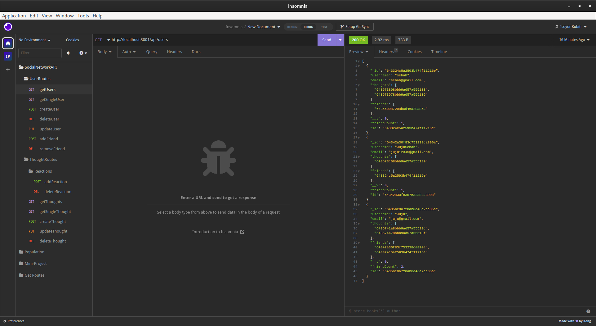
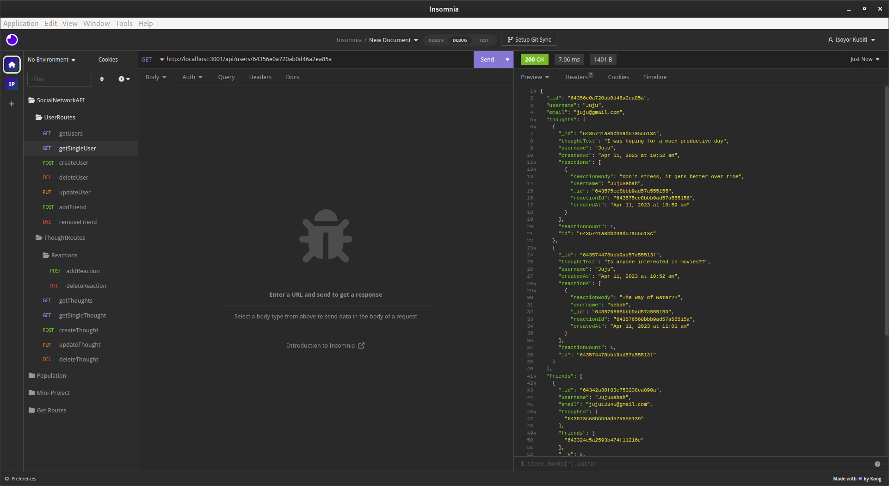
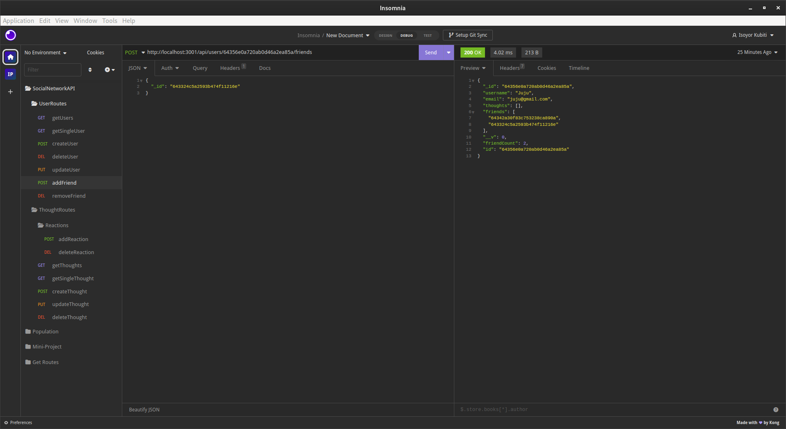
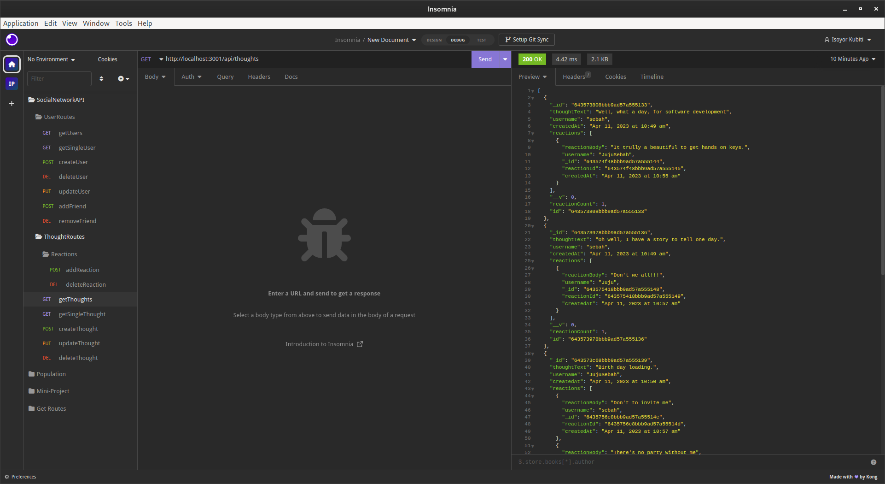
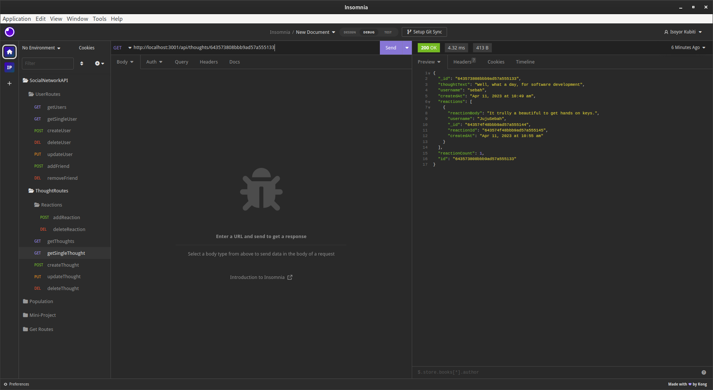
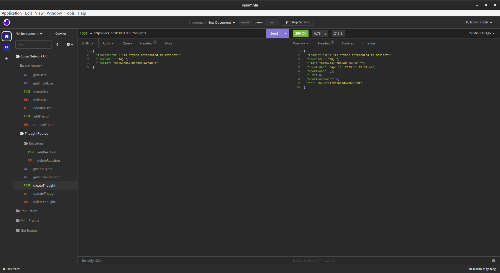
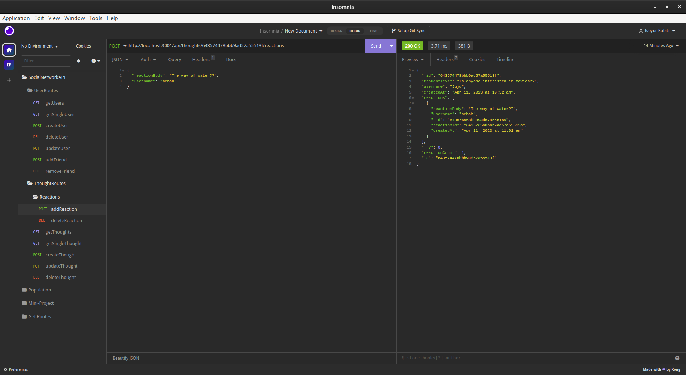
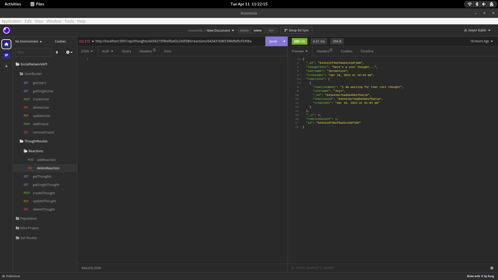
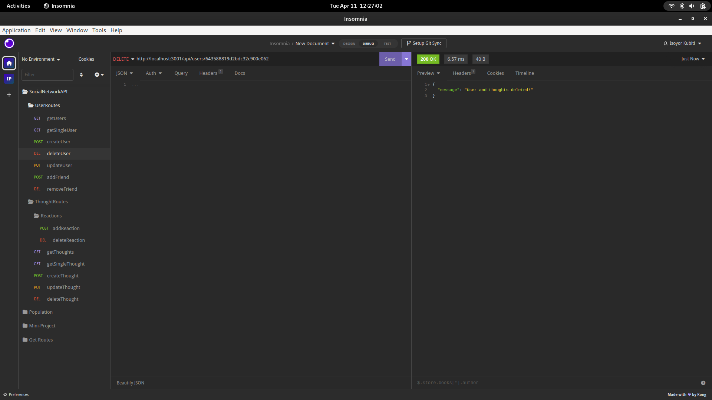

# SOCIAL-NETWORK-API
Building an API for a social Network App using NoSQL database MongoDb, Mongoose ODM, and Express.

      

## Description

This project creates a NoSQL API for a social Network App using MongoDb database, Mongoose ODM, and Express. The API allows a user to create an account, add friends, add thoughts, react to other thoughts, update their account information, delete friends, thoughts, and reactions. The user can delete their account and this also deletes their thoughts.


My objectives for this application is based on the following user story and acceptance criteria;

### User Story

```md
AS A social media startup
I WANT an API for my social network that uses a NoSQL database
SO THAT my website can handle large amounts of unstructured data
```

## Acceptance Criteria

```md
GIVEN a social network API
WHEN I enter the command to invoke the application
THEN my server is started and the Mongoose models are synced to the MongoDB database
WHEN I open API GET routes in Insomnia for users and thoughts
THEN the data for each of these routes is displayed in a formatted JSON
WHEN I test API POST, PUT, and DELETE routes in Insomnia
THEN I am able to successfully create, update, and delete users and thoughts in my database
WHEN I test API POST and DELETE routes in Insomnia
THEN I am able to successfully create and delete reactions to thoughts and add and remove friends to a user’s friend list
```

## Table of Contents

- [Description](#description)
- [Installation](#installation)
- [Usage](#usage)
- [Questions](#questions)
- [License](#license)

---

## Installation

To run setup the backend of the application, you will need to install Node.js and once installed, you will run the following command in the root directory of the application:

- npm install

This command will install all dependencies found in the package.json file required by the application to execute. Once all the packages are successfully installed, you are ready to start the server for the API. You wil start the server with the command below:

- npm run dev

Once the server is running, you can connect Insomnia to it locally on the port used in the server file.

## Usage

Open an instance of Insomnia and perform http requests based on the routes defined in the thought and users route files.


This link shows a demonstration of the API responses and usage using Insomnia: [Demonstration video of Social Network Backend API](https://drive.google.com/file/d/1b22jGGKmWCfpXk3FM-e9ki8IJ25pjQrM/view?usp=sharing).

The picture below shows using Insomnia to list all the users on the server



This picture shows a user with details of their network of friends . 



This page shows the server response after adding a friend to a user social network.



This page displays the full list of thoughts on the server.



The server responding to the request for a user's single thought.



The server response after a user adds a new thought



The server's response to adding a reaction to a thought.



The server response after deleting a reaction to a thought.




The server deletes a user and all their thoughts when their account get deleted. 




## Questions

If you have any questions, please feel free to reach out to me at: [ikubiti@icloud.com](mailto:ikubiti@icloud.com).

Alternatively, you may find me on GitHub at [https://github.com/ikubiti](https://github.com/ikubiti).

---

## License

Copyright (c) ikubiti. All rights reserved.

Licensed under the [MIT](./LICENSE) license.